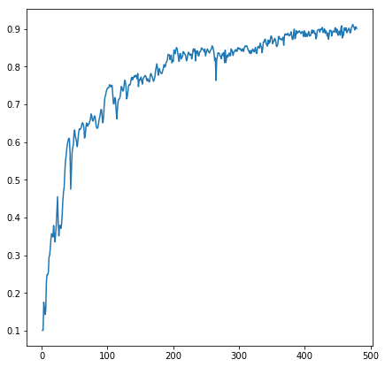
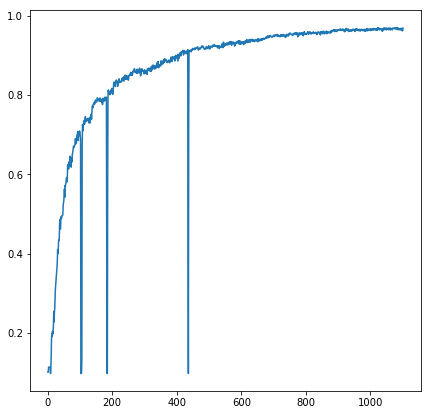

# Doolittle Labeling

## Problem

Neural network machine learning applications often require tens of thousands of training examples to achieve acceptable performance on basic tasks.
These examples are costly to label as they are primarily done manually by humans.

## Technique

Instead of wasting human energy labeling data that the machine learning system already understands, focus human effort on the examples the machine learning system is the least sure about.

This is implemented as finding the example with the smallest maximum value in the classified output.

```python
model.predict(X_train).max(axis=1).argmin()
```
Well understood examples will have a large disparity between classes. Ex `[0.001, 0.002, 0.99, 0.001]`.
Poorly understood examples will have a relatively uniform prediction between classes. Ex `[0.23, 0.31, 0.15, 0.22]`.
This strategy chooses to have the "human" label the latter data as it will provide more useful information to the system.

Otherwise, the network is trained with the small set of examples in a very standard way.

## Results

The following notebook, [lazy_mnist.ipynb](lazy_mnist.ipynb), demonstrates how a simple densely connected neural network can achieve ~90% test accuraccy on the full dataset with only 500 labeled images, compared to the usual 60,000.

x-axis: Number of labeled data

y-axis: Accuracy against standard 10,000 sample test dataset



The following notebook, [lazy_mnist_cnn.ipynb](lazy_mnist_cnn.ipynb), demonstrates the same technique, with a slightly more complex CNN and a larger training sample range.

The large vertical dips show where I manually reset the model weights during training to test whether the improved accuracy was due to more training time or the increased number of labeled examples.
It is quite conclusive that the consecutive training provides little to no benefit, leaving nearly 100% of the benefit due to the increased number of labeled examples.



The following notebook, [lazy_mnist_cnn_stddev.ipynb](lazy_mnist_cnn_stddev.ipynb), shows that labeling the example with the smallest standard deviation was nearly as effective. It does not show that calculating the standard deviation was dramatically slower, therefore effectively not worth it.

## Further work

1. Improvements to the "least understood example" selection technique. This smallest maximum should work well for classification tasks.
1. Testing against more complex data sets with more complex networks.
1. Running interactively with a human manually labeling the data during training. I weakly conjecture that some of the examples in the MNIST data set may be mislabeled or ambiguous, resulting in poorer than possible performance of this technique. This technique should discover those examples first and place greater relative weight on those than the full dataset would.

## Notes

1. I get to name this after myself because I thought of it and tested it.
1. I don't believe a more "proper" presentation of this idea is necessary. If someone wants to write a proper white-paper, there's free co-author credit in it for you.
